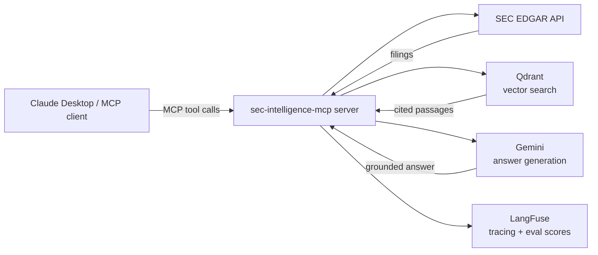
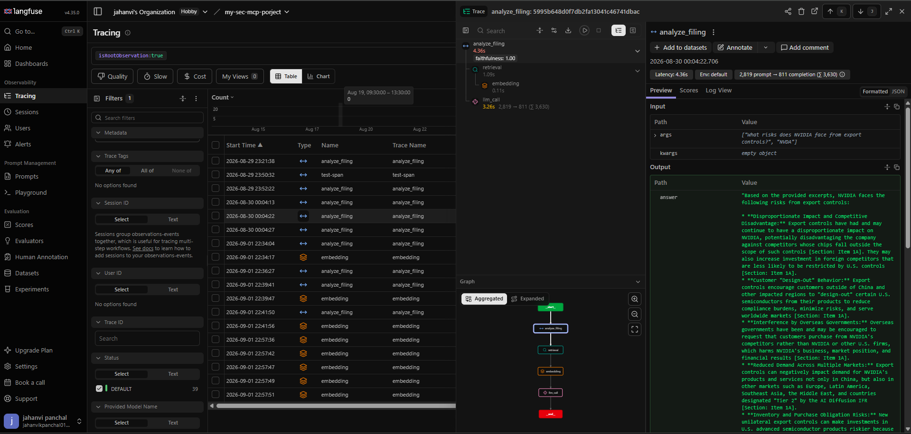

<!-- mcp-name: io.github.jahanv01/sec-intelligence-mcp -->

# 🔎 SEC Intelligence MCP — Document-Grounded Financial AI

MCP server for SEC EDGAR filing intelligence, fetching, chunking/embedding, retrieval, and evaluation, exposed as tools an MCP client (e.g. Claude Desktop) can call.

## Why this is different from other finance MCP servers

Most finance-related MCP servers in the wild are data-API wrappers -- they return structured
numbers (revenue, EPS, price) from a provider's database. None of the ones we surveyed read
the actual filing documents, so none can answer a question that requires understanding what
a company's management actually *said* -- e.g. "how did NVIDIA's management explain the
datacenter revenue surge?" or "did Amazon's forward guidance tone change between quarters?".

This server retrieves and quotes the real filing text (10-K, 10-Q, 8-K) with a citation --
section name and, where available, page number -- on every claim, and its answer-generation
prompt explicitly refuses to use prior/general knowledge when the retrieved passages don't
contain the answer (verified: asking about NVIDIA's non-existent "Mars operations" correctly
returns "not present in the filing" rather than an invented one). It also has an automated
RAGAS evaluation harness (see below) that measures this claim rather than asserting it.

## Architecture



## Available tools

| Tool | What it does | Example question |
|---|---|---|
| `ingest_company_filings` | Fetches, parses, and indexes a company's recent SEC filings so they can be searched/analyzed | "Ingest NVIDIA's last 3 10-Ks" |
| `search_filings` | Semantic search across ingested filings, returns passages with citations | "Search Apple's 10-K for anything about AI investment" |
| `analyze_filing` | Answers a specific question with a grounded, cited answer (RAG) | "What were Apple's main risk factors in their 2024 10-K?" |
| `get_filing_summary` | Structured executive summary of a full filing (business, financials, MD&A, risks, outlook) | "Summarize NVIDIA's latest 10-K" |
| `compare_companies` | Side-by-side comparison of 2-4 companies on a specific aspect, grounded in each company's own filing | "Compare NVIDIA and AMD's AI chip strategy" |
| `detect_financial_anomalies` | Flags notable year-over-year changes in a company's MD&A/risk disclosures | "Did NVIDIA's risk language around China change between 2023 and 2024?" |
| `get_earnings_summary` | Extracts headline metrics, guidance, and management commentary from a quarterly earnings release (8-K) | "Summarize Apple's Q2 2024 earnings" |

## Evaluation results

Measured with [RAGAS](https://github.com/explodinggradients/ragas) on 50 hand-verified
question/ground-truth pairs across 5 companies (full methodology and raw results in
[`eval/README.md`](eval/README.md)):

| Retrieval strategy | Faithfulness | Correctness | Context Recall |
|---|---|---|---|
| v1: semantic-only (dense embeddings) | 0.92 | 0.67 | 0.84 |
| v2: hybrid (BM25 + semantic via RRF) -- **production default** | 0.95 | 0.78 | 0.99 |
| v3: hybrid + cross-encoder reranking | **0.98** | **0.82** | **1.00** |

CI's eval-gate fails any PR to `main` that drops faithfulness below 0.75 on a real,
live-ingested subset of these questions -- see `.github/workflows/ci.yml`.

## LangFuse dashboard

A real trace of `analyze_filing` answering "What risks does NVIDIA face from export
controls?" -- the span tree shows `retrieval` and `embedding` nested under the tool call,
alongside the LLM generation, with a `faithfulness: 1.00` score attached automatically:



## Contributing

Issues and PRs welcome. See `docs/edgar-api.md` for EDGAR API quirks (rate limits, required
User-Agent header) and `eval/README.md` before changing anything in the retrieval pipeline --
a PR that regresses RAGAS faithfulness below 0.75 will fail CI's eval-gate job.

## Hosted deployment (Oracle Cloud Always Free)

Deployed on an Oracle Cloud "Always Free" compute VM (Ampere A1, ARM) rather than Render or
Hugging Face Spaces: both of those give the container an *ephemeral* filesystem (wiped on
every restart/redeploy) and cap free-tier RAM at 512MB, which doesn't comfortably fit the
embedding model (e5-base-v2, CPU-only, ~440MB loaded) alongside the rest of the process. A
real Always Free VM has neither constraint -- genuine persistent disk and up to 24GB RAM --
so Qdrant runs locally via the same `docker-compose.yml` used for local dev, with no
separate Qdrant Cloud account needed.

Setup (one-time):
1. Create an Always Free Ampere A1 compute instance (Ubuntu image) in the Oracle Cloud
   console, and note its public IP.
2. In the VCN's **Security List** (not just the instance's own firewall -- both must allow
   it), add an ingress rule for TCP port `8000` (and `22` for SSH, usually already open).
3. SSH in, install Docker + the Compose plugin, then:
   ```
   git clone https://github.com/<your-username>/sec-intelligence-mcp.git
   cd sec-intelligence-mcp
   cp .env.example .env   # fill in GEMINI_API_KEY, LANGFUSE_SECRET_KEY, LANGFUSE_PUBLIC_KEY
   echo "MCP_TRANSPORT=sse" >> .env
   sudo docker compose up -d --build
   ```
   `QDRANT_URL` doesn't need to be set in `.env` here -- `docker-compose.yml` already
   overrides it to `http://qdrant:6333`, the in-network service name, for the `app` service.
4. Also open the instance's own firewall for the port (Ubuntu ships `iptables`/`ufw` rules
   that block it even after the Security List allows it):
   ```
   sudo iptables -I INPUT -p tcp --dport 8000 -j ACCEPT
   sudo netfilter-persistent save   # or: sudo ufw allow 8000/tcp
   ```
5. Confirm: `curl http://<instance-public-ip>:8000/health` returns `ok`.

Both services have `restart: unless-stopped`, so a VM reboot brings the whole stack back up
without manual intervention. Plain HTTP (no TLS/domain) is used for now -- fine for a demo,
but a real production deployment would put Caddy or Nginx in front for HTTPS.

### Alternative: Hugging Face Spaces (prepared, not the current deployment)

The YAML frontmatter at the top of this README is Spaces metadata (Docker SDK), left in
place in case this becomes the deployment target again -- it's inert otherwise. To use it:
huggingface.co -> New Space -> SDK: Docker -> create it, add `GEMINI_API_KEY`, `QDRANT_URL`,
`QDRANT_API_KEY`, `LANGFUSE_SECRET_KEY`, `LANGFUSE_PUBLIC_KEY` as **secrets** and
`MCP_TRANSPORT=sse` as a **variable** in Space Settings, then `git push` this repo to the
Space's git remote. Spaces storage is ephemeral on restart like Render's free tier, so this
path still needs a separate Qdrant Cloud instance rather than the local Qdrant container.

## Quick install

Published on PyPI: https://pypi.org/project/sec-intelligence-mcp/. No clone needed --
[uv](https://docs.astral.sh/uv/getting-started/installation/) fetches and runs it on demand:

```
uvx sec-intelligence-mcp
```

You'll still need the API keys below set as environment variables (or in Claude Desktop's
config -- see "Connecting Claude Desktop") and a reachable Qdrant instance (local via Docker,
or Qdrant Cloud); `uvx` only handles getting the code installed and running, not those.

## Setup (for local development)

Contributing, or want to run from source instead of the published package:

1. Install [uv](https://docs.astral.sh/uv/getting-started/installation/).
2. Install dependencies:
   ```
   uv sync
   ```
3. Copy `.env.example` to `.env` and fill in the keys (see below).
4. Start Qdrant locally:
   ```
   docker compose up -d qdrant
   ```
5. Run the server directly:
   ```
   uv run python src/server.py
   ```
   Or with the MCP Inspector (dev UI, requires Node.js):
   ```
   uv run mcp dev src/server.py
   ```

## Running via Docker

`docker compose up -d` builds the server image and starts it alongside Qdrant. The `app`
service reads secrets from your local `.env` via `env_file`, and `QDRANT_URL` is overridden
to `http://qdrant:6333` (the in-network service name) since `localhost` inside the container
would not reach the `qdrant` container. `config.py` still fails fast if `.env` is missing
required keys.

## Getting API keys (all free)

| Variable | Where to get it |
|---|---|
| `GEMINI_API_KEY` | https://aistudio.google.com/apikey — free tier, sign in with Google account |
| `QDRANT_URL` | `http://localhost:6333` when running Qdrant via `docker compose up -d qdrant` (no signup needed) |
| `QDRANT_API_KEY` | Only needed for a hosted Qdrant Cloud instance; leave blank for local |
| `LANGFUSE_SECRET_KEY` / `LANGFUSE_PUBLIC_KEY` | https://cloud.langfuse.com — free tier, create a project, copy keys from Settings → API Keys |
| `SEC_EDGAR_USER_AGENT` | Optional. Any string of the form `"AppName you@email.com"`; EDGAR just wants a way to identify/contact you |
| `EMBEDDING_MODEL` | Optional. Defaults to `intfloat/e5-base-v2`; no signup needed, downloads from Hugging Face on first use |
| `GEMINI_MODEL` | Optional. Defaults to `gemini-flash-lite-latest` |

`src/config.py` fails fast at import time (raises `RuntimeError`) if any required key is missing.

## Connecting Claude Desktop

Add this to your `claude_desktop_config.json` (on Windows:
`%APPDATA%\Claude\claude_desktop_config.json`) -- using the published package, no clone needed:

```json
{
  "mcpServers": {
    "sec-intelligence-mcp": {
      "command": "uvx",
      "args": ["sec-intelligence-mcp"],
      "env": {
        "GEMINI_API_KEY": "your-key",
        "QDRANT_URL": "http://localhost:6333",
        "LANGFUSE_SECRET_KEY": "your-key",
        "LANGFUSE_PUBLIC_KEY": "your-key"
      }
    }
  }
}
```

Running from a local clone instead (see "Setup" above)? Use this config instead:

```json
{
  "mcpServers": {
    "sec-intelligence-mcp": {
      "command": "uv",
      "args": [
        "--directory",
        "C:\\ABSOLUTE\\PATH\\TO\\sec-intelligence-mcp",
        "run",
        "python",
        "src/server.py"
      ]
    }
  }
}
```

Restart Claude Desktop, open the tools list, and confirm `sec-intelligence-mcp` appears with a
`ping` tool that returns `"pong"`.

## Testing locally

```
uv run python -c "import mcp"                    # SDK installed correctly
uv run python scripts/test_server_stdio.py        # server responds over stdio (ping -> pong)
docker compose up -d qdrant
uv run python scripts/test_qdrant.py               # Qdrant round-trip works

# EDGAR data layer (each hits the real EDGAR API)
uv run python scripts/test_edgar_lookup.py         # ticker -> CIK, DuckDB-cached
uv run python scripts/test_edgar_filings.py        # recent 10-K filings for a ticker
uv run python scripts/test_edgar_parser.py         # download + clean a real filing
uv run python scripts/test_edgar_sections.py       # section detection + metadata

# Embedding & retrieval pipeline (real model + real Qdrant)
uv run python scripts/test_chunker.py              # section/paragraph chunking
uv run python scripts/test_encoder.py              # E5 embedding shape/latency
uv run python scripts/test_ingest.py               # chunk -> embed -> upsert to Qdrant
uv run python scripts/test_search.py               # semantic search with citations

# MCP tools (real pipeline + real Gemini calls)
uv run python scripts/test_tool_ingest_company_filings.py
uv run python scripts/test_tool_search_filings.py
uv run python scripts/test_tool_analyze_filing.py
uv run python scripts/test_tool_get_filing_summary.py
```

## Project structure

```
src/
├── server.py        # MCP server entrypoint
├── tools/            # One file per MCP tool
├── edgar/            # SEC EDGAR fetching + parsing
├── embeddings/        # Chunking + embedding pipeline
├── retrieval/         # Qdrant client + search
├── evaluation/         # RAGAS eval pipeline
└── config.py          # Env var loading (fail-fast)
tests/                  # Unit/integration tests
prompts/                # Prompt templates (.txt)
data/                   # Gitignored local cache (DuckDB, filing PDFs, Qdrant storage)
eval/                   # Test questions + ground truth answers
scripts/                # One-off dev/test scripts
```
