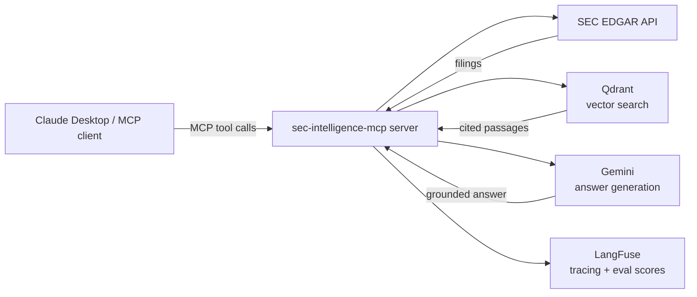

<!-- mcp-name: io.github.jahanv01/sec-intelligence-mcp -->

# 🔎 SEC Intelligence MCP — Document-Grounded Financial AI

Ask Claude Desktop real questions about SEC filings — 10-Ks, 10-Qs, 8-Ks — and get answers
quoted directly from the actual filing text, with a citation to the exact section (and page,
where available) on every claim. Not a summary from training data. Not a guess.

**Try it now:** `uvx sec-intelligence-mcp` — see [Quick install](#quick-install) below.

## Why this is different

Most finance-related MCP servers are data-API wrappers: they hand back numbers (revenue,
EPS, price) from a database. None of the ones we surveyed read the actual filing documents,
so none can answer a question that requires understanding what a company's management
actually *said* — e.g. "how did NVIDIA's management explain the datacenter revenue surge?"
or "did Amazon's forward guidance tone change between quarters?"

This server retrieves and quotes the real filing text with a citation on every claim, and its
answer-generation prompt explicitly refuses to use prior/general knowledge when the retrieved
passages don't contain the answer — verified live: asking about NVIDIA's non-existent "Mars
operations" correctly returns "not present in the filing" rather than an invented answer. It
also ships an automated RAGAS evaluation harness (see [Evaluation results](#evaluation-results))
that measures this claim on 50 real questions rather than just asserting it.

---

## 🚀 Quick install

Published on PyPI: https://pypi.org/project/sec-intelligence-mcp/. No clone, no build step —
[uv](https://docs.astral.sh/uv/getting-started/installation/) fetches and runs it on demand:

```
uvx sec-intelligence-mcp
```

That's the whole install. Two more things and you're ready to use it in Claude Desktop:

### 1. Get your free API keys

All four take under 5 minutes total, no credit card anywhere.

| Variable | Where to get it | Required? |
|---|---|---|
| `GEMINI_API_KEY` | https://aistudio.google.com/apikey — sign in with a Google account | Yes |
| `QDRANT_URL` | `http://localhost:6333` if you run Qdrant locally via Docker (`docker run -p 6333:6333 qdrant/qdrant`), or a free cluster URL from https://cloud.qdrant.io | Yes |
| `LANGFUSE_SECRET_KEY` / `LANGFUSE_PUBLIC_KEY` | https://cloud.langfuse.com — free tier, create a project, copy both keys from Settings → API Keys | Yes |
| `QDRANT_API_KEY` | Only if using Qdrant Cloud instead of local Docker | No |

Don't have Docker or want to skip signing up for Qdrant? See the note in
[Getting Qdrant running](#getting-qdrant-running) below.

### 2. Connect Claude Desktop

Add this to your `claude_desktop_config.json`
(Windows: `%APPDATA%\Claude\claude_desktop_config.json`, macOS: `~/Library/Application Support/Claude/claude_desktop_config.json`):

```json
{
  "mcpServers": {
    "sec-intelligence-mcp": {
      "command": "uvx",
      "args": ["sec-intelligence-mcp"],
      "env": {
        "GEMINI_API_KEY": "your-key",
        "QDRANT_URL": "http://localhost:6333",
        "LANGFUSE_SECRET_KEY": "your-key",
        "LANGFUSE_PUBLIC_KEY": "your-key"
      }
    }
  }
}
```

Restart Claude Desktop, open the tools list (hammer icon), and confirm `sec-intelligence-mcp`
appears with a `ping` tool. That confirms the connection works before you rely on it for a
real question.

### 3. Try it out

Every session starts by ingesting the company you want to ask about — that's what indexes its
filings so they can be searched. Then just ask in plain English:

> **You:** Ingest NVIDIA's last 2 annual filings
>
> **Claude** *(calls `ingest_company_filings`)*: Indexed 2 filings for NVIDIA — 312 chunks
> from FY2024's 10-K, 287 from FY2023's.
>
> **You:** What did they say about risks from export controls?
>
> **Claude** *(calls `analyze_filing`)*: NVIDIA's FY2024 10-K identifies export control
> regulations as a primary risk: "The U.S. government has imposed, and may in the future
> impose, controls on the export of our products... restrictions to China, Hong Kong, and
> Russia have materially impacted our revenue." — *[Item 1A — Risk Factors]*
>
> **You:** How does that compare to AMD?
>
> **Claude** *(calls `compare_companies`)*: [grounded side-by-side answer, cited to each
> company's own filing]

No prompt engineering, no special syntax — Claude picks the right tool automatically based on
what you ask.

---

## 🧰 Available tools

| Tool | What it does | Example question |
|---|---|---|
| `ingest_company_filings` | Fetches, parses, and indexes a company's recent SEC filings | "Ingest NVIDIA's last 3 10-Ks" |
| `search_filings` | Semantic search across ingested filings, returns passages with citations | "Search Apple's 10-K for anything about AI investment" |
| `analyze_filing` | Answers a specific question with a grounded, cited answer (RAG) | "What were Apple's main risk factors in their 2024 10-K?" |
| `get_filing_summary` | Structured executive summary of a full filing (business, financials, MD&A, risks, outlook) | "Summarize NVIDIA's latest 10-K" |
| `compare_companies` | Side-by-side comparison of 2-4 companies on a specific aspect, grounded in each company's own filing | "Compare NVIDIA and AMD's AI chip strategy" |
| `detect_financial_anomalies` | Flags notable year-over-year changes in a company's MD&A/risk disclosures | "Did NVIDIA's risk language around China change between 2023 and 2024?" |
| `get_earnings_summary` | Extracts headline metrics, guidance, and management commentary from a quarterly earnings release (8-K) | "Summarize Apple's Q2 2024 earnings" |

## 🛠️ Tech stack

Open source and free-tier first — no paid API is required to run this end to end.

| Layer | Tool | Why |
|---|---|---|
| MCP protocol | [`mcp`](https://github.com/modelcontextprotocol/python-sdk) Python SDK | Official Anthropic SDK |
| SEC data | [SEC EDGAR](https://www.sec.gov/edgar) Full-Text & Submissions API | Official, free, no API key |
| Embeddings | [sentence-transformers](https://www.sbert.net/) — `intfloat/e5-base-v2` | Runs on CPU, no GPU needed |
| Vector store | [Qdrant](https://qdrant.tech/) | Free self-host (Docker) or Qdrant Cloud |
| Local cache | [DuckDB](https://duckdb.org/) | Ticker lookups, filing metadata, BM25 text |
| Keyword search | [rank-bm25](https://github.com/dorianbrown/rank_bm25) | Hybrid retrieval alongside dense search |
| Reranking | sentence-transformers `CrossEncoder` (`ms-marco-MiniLM-L-6-v2`) | Re-scores top candidates before the LLM sees them |
| HTML/PDF parsing | `beautifulsoup4`, `pdfplumber` | Cleans raw filing documents to text |
| LLM | [Google Gemini](https://aistudio.google.com/) (free tier) | Answer generation |
| Observability | [LangFuse](https://langfuse.com/) | Tracing, spans, faithfulness scores |
| Evaluation | [RAGAS](https://github.com/explodinggradients/ragas) | Automated faithfulness/correctness/recall scoring |
| Testing | `pytest`, `pytest-asyncio` | 120+ tests, fully mocked, no network calls |
| Linting | [Ruff](https://docs.astral.sh/ruff/) | |
| CI/CD | GitHub Actions | Lint, test, Docker build, eval-gate on every PR |
| Containerization | Docker + Docker Compose | |
| Deployment | Oracle Cloud "Always Free" tier | Real persistent disk, up to 24GB RAM, $0 |
| Packaging | PyPI + `uv`/`uvx`, [Hatchling](https://hatch.pypa.io/) | One-command install, no clone needed |

## 🏗️ Architecture



## 📊 Evaluation results

Measured with [RAGAS](https://github.com/explodinggradients/ragas) on 50 hand-verified
question/ground-truth pairs across 5 companies (full methodology and raw results in
[`eval/README.md`](eval/README.md)):

| Retrieval strategy | Faithfulness | Correctness | Context Recall |
|---|---|---|---|
| v1: semantic-only (dense embeddings) | 0.92 | 0.67 | 0.84 |
| v2: hybrid (BM25 + semantic via RRF) — **production default** | 0.95 | 0.78 | 0.99 |
| v3: hybrid + cross-encoder reranking | **0.98** | **0.82** | **1.00** |

CI's eval-gate fails any PR to `main` that drops faithfulness below 0.75 on a real,
live-ingested subset of these questions — see [`.github/workflows/ci.yml`](.github/workflows/ci.yml).

### LangFuse dashboard

A real trace of `analyze_filing` answering "What risks does NVIDIA face from export
controls?" — the span tree shows `retrieval` and `embedding` nested under the tool call,
alongside the LLM generation, with a `faithfulness: 1.00` score attached automatically:


---

## 👩‍💻 For developers

Want to run from source, contribute, or self-host instead of using the published package?

### Getting Qdrant running

The simplest path is Docker: `docker run -p 6333:6333 qdrant/qdrant`. No Docker? Use a free
[Qdrant Cloud](https://cloud.qdrant.io) cluster instead and set `QDRANT_API_KEY` too.

### Run from a local clone

1. Install [uv](https://docs.astral.sh/uv/getting-started/installation/).
2. Clone the repo and install dependencies:
   ```
   git clone https://github.com/jahanv01/sec-intelligence-mcp.git
   cd sec-intelligence-mcp
   uv sync
   ```
3. Copy `.env.example` to `.env` and fill in the keys from the table above.
4. Start Qdrant locally:
   ```
   docker compose up -d qdrant
   ```
5. Run the server directly:
   ```
   uv run python src/server.py
   ```
   Or with the MCP Inspector (dev UI, requires Node.js):
   ```
   uv run mcp dev src/server.py
   ```

For Claude Desktop, point it at your clone instead of the published package:

```json
{
  "mcpServers": {
    "sec-intelligence-mcp": {
      "command": "uv",
      "args": [
        "--directory",
        "C:\\ABSOLUTE\\PATH\\TO\\sec-intelligence-mcp",
        "run",
        "python",
        "src/server.py"
      ]
    }
  }
}
```

`src/config.py` fails fast at import time (raises `RuntimeError`) if any required key is
missing.

### Running via Docker

`docker compose up -d` builds the server image and starts it alongside Qdrant. The `app`
service reads secrets from your local `.env` via `env_file`, and `QDRANT_URL` is overridden
to `http://qdrant:6333` (the in-network service name) since `localhost` inside the container
would not reach the `qdrant` container.

### Testing locally

```
uv run python -c "import mcp"                    # SDK installed correctly
uv run python scripts/test_server_stdio.py        # server responds over stdio (ping -> pong)
docker compose up -d qdrant
uv run python scripts/test_qdrant.py               # Qdrant round-trip works

# EDGAR data layer (each hits the real EDGAR API)
uv run python scripts/test_edgar_lookup.py         # ticker -> CIK, DuckDB-cached
uv run python scripts/test_edgar_filings.py        # recent 10-K filings for a ticker
uv run python scripts/test_edgar_parser.py         # download + clean a real filing
uv run python scripts/test_edgar_sections.py       # section detection + metadata

# Embedding & retrieval pipeline (real model + real Qdrant)
uv run python scripts/test_chunker.py              # section/paragraph chunking
uv run python scripts/test_encoder.py              # E5 embedding shape/latency
uv run python scripts/test_ingest.py               # chunk -> embed -> upsert to Qdrant
uv run python scripts/test_search.py               # semantic search with citations

# MCP tools (real pipeline + real Gemini calls)
uv run python scripts/test_tool_ingest_company_filings.py
uv run python scripts/test_tool_search_filings.py
uv run python scripts/test_tool_analyze_filing.py
uv run python scripts/test_tool_get_filing_summary.py

# Full mocked suite (no network calls)
uv run pytest tests/ -m "not integration"
```

### Project structure

```
src/
├── server.py         # MCP server entrypoint
├── tools/             # One file per MCP tool
├── edgar/             # SEC EDGAR fetching + parsing
├── embeddings/        # Chunking + embedding pipeline
├── retrieval/         # Qdrant client + search + hybrid + rerank
├── evaluation/         # RAGAS eval pipeline
└── config.py          # Env var loading (fail-fast)
tests/                  # Unit/integration tests
prompts/                # Prompt templates (.txt)
data/                   # Gitignored local cache (DuckDB, filing PDFs, Qdrant storage)
eval/                   # Test questions + ground truth answers
scripts/                # One-off dev/test scripts
```

### Deploy your own instance

The published PyPI package is enough for personal use via Claude Desktop — you only need
this if you want a standalone, publicly reachable server (e.g. for a remote MCP client).

Deployed on an Oracle Cloud "Always Free" compute VM (Ampere A1, ARM) rather than Render or
Hugging Face Spaces: both of those give the container an *ephemeral* filesystem (wiped on
every restart/redeploy) and cap free-tier RAM at 512MB, which doesn't comfortably fit the
embedding model (e5-base-v2, CPU-only, ~440MB loaded) alongside the rest of the process. A
real Always Free VM has neither constraint — genuine persistent disk and up to 24GB RAM — so
Qdrant runs locally via the same `docker-compose.yml` used for local dev, with no separate
Qdrant Cloud account needed.

Setup (one-time):
1. Create an Always Free Ampere A1 compute instance (Ubuntu image) in the Oracle Cloud
   console, and note its public IP.
2. In the VCN's **Security List** (not just the instance's own firewall — both must allow
   it), add an ingress rule for TCP port `8000` (and `22` for SSH, usually already open).
3. SSH in, install Docker + the Compose plugin, then:
   ```
   git clone https://github.com/jahanv01/sec-intelligence-mcp.git
   cd sec-intelligence-mcp
   cp .env.example .env   # fill in GEMINI_API_KEY, LANGFUSE_SECRET_KEY, LANGFUSE_PUBLIC_KEY
   echo "MCP_TRANSPORT=sse" >> .env
   sudo docker compose up -d --build
   ```
   `QDRANT_URL` doesn't need to be set in `.env` here — `docker-compose.yml` already
   overrides it to `http://qdrant:6333`, the in-network service name, for the `app` service.
4. Also open the instance's own firewall for the port (Ubuntu ships `iptables`/`ufw` rules
   that block it even after the Security List allows it):
   ```
   sudo iptables -I INPUT -p tcp --dport 8000 -j ACCEPT
   sudo netfilter-persistent save   # or: sudo ufw allow 8000/tcp
   ```
5. Confirm: `curl http://<instance-public-ip>:8000/health` returns `ok`.

Both services have `restart: unless-stopped`, so a VM reboot brings the whole stack back up
without manual intervention. Plain HTTP (no TLS/domain) is used for now — fine for a demo,
but a real production deployment would put Caddy or Nginx in front for HTTPS.

**Alternative: Hugging Face Spaces.** Also possible via the Docker SDK, using Qdrant Cloud
instead of a local container (Spaces storage is ephemeral on restart, unlike a real VM).
huggingface.co → New Space → SDK: Docker → add `GEMINI_API_KEY`, `QDRANT_URL`,
`QDRANT_API_KEY`, `LANGFUSE_SECRET_KEY`, `LANGFUSE_PUBLIC_KEY` as **secrets** and
`MCP_TRANSPORT=sse` as a **variable** in Space Settings, then `git push` this repo to the
Space's git remote.

## 🤝 Contributing

Issues and PRs welcome. See [`docs/edgar-api.md`](docs/edgar-api.md) for EDGAR API quirks
(rate limits, required User-Agent header) and [`eval/README.md`](eval/README.md) before
changing anything in the retrieval pipeline — a PR that regresses RAGAS faithfulness below
0.75 will fail CI's eval-gate job.
